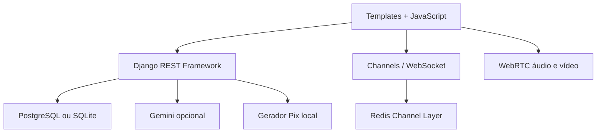

<div align="center">

# PULSO

### Rede social para quem transforma ideia em linguagem

**Crie · conecte · colabore · apoie**

[Aplicação online](#deploy) · [API Swagger](#api-rest) · [Arquitetura](#arquitetura) · [Segurança](#segurança-e-privacidade)

</div>

---

PULSO é uma rede social brasileira pensada para fotógrafos, nail artists, cabeleireiros, designers, tatuadores, músicos, pintores e pessoas de todas as expressões criativas. O projeto combina publicação de portfólio, descoberta, conexões profissionais, apoio direto e conversas em tempo real em uma experiência original e responsiva.

Este é o projeto final do curso de Python da EBAC. Ele cumpre os requisitos de autenticação, perfil, sistema de seguidores, feed, curtidas, comentários, API REST e deploy — e amplia o escopo com uma base de produto contemporânea.

## O que já funciona

### Comunidade

- cadastro e login por sessão segura;
- perfil editável com nome, senha, bio, foto, capa, área criativa, localização e portfólio;
- seguir/deixar de seguir, listas de seguidores e seguidos;
- bloqueio de usuários com remoção automática das conexões;
- feed estrito: exibe publicações apenas de pessoas seguidas;
- exploração de trabalhos por categoria, texto, tags e criador;
- posts de até 500 caracteres com imagem, vídeo, tags e link de portfólio;
- curtidas, comentários/respostas, reposts e favoritos;
- notificações de conexões e interações.

### Conversa e colaboração

- conversas diretas privadas;
- mensagens em tempo real com Django Channels/WebSocket;
- conteúdo das mensagens cifrado em repouso;
- indicação de digitação e leitura;
- chamadas de áudio e vídeo peer-to-peer com WebRTC;
- STUN padrão e suporte configurável a TURN para redes restritivas.

### Economia criativa e IA

- chave Pix cifrada no perfil;
- QR Code Pix Copia e Cola gerado no backend seguindo o padrão EMV;
- transferência ocorre diretamente entre apoiador e criador: a PULSO não custodia valores;
- assistente editorial de legendas com Gemini quando a chave está configurada;
- fallback local funcional quando não há Gemini, sem quebrar o produto;
- rate limit próprio para IA para evitar abuso e consumo inesperado.

## Experiência visual

A interface é autoral. A direção combina tipografia editorial, espaços generosos, cores de alto contraste, microinterações e cartões com movimento sutil. O produto não copia componentes ou identidade de outra rede. Há modo responsivo completo e respeito a `prefers-reduced-motion` para acessibilidade.

## Arquitetura



| Módulo | Responsabilidade |
|---|---|
| `apps/accounts` | usuário, perfil, seguidores, bloqueios e autenticação |
| `apps/social` | posts, comentários, curtidas, reposts, favoritos e notificações |
| `apps/chat` | conversas, mensagens cifradas, WebSocket e sinalização WebRTC |
| `apps/payments` | payload/QR Pix e intenções de apoio sem custódia financeira |
| `apps/assistant` | assistente editorial Gemini com fallback local |
| `apps/webapp` | páginas, shell visual, middleware e tratamento uniforme de erros |

## Tecnologias

- Python 3.12, Django 5.2 e Django REST Framework;
- Django Channels, Daphne e Redis;
- PostgreSQL em produção e SQLite no desenvolvimento;
- JavaScript moderno, WebSocket e WebRTC;
- Google GenAI SDK opcional;
- Argon2, Fernet, CSP, CSRF, throttling e permissões por objeto;
- Docker, Render Blueprint e GitHub Actions.

## Rodando localmente

```bash
git clone https://github.com/labyrt/pulso-rede-criativa.git
cd pulso-rede-criativa
python -m venv .venv
source .venv/bin/activate  # Windows: .venv\Scripts\activate
pip install -r requirements.txt
cp .env.example .env
python manage.py migrate
python manage.py seed_demo
python manage.py runserver
```

Acesse `http://127.0.0.1:8000`. Os dados de demonstração são descritos pelo comando `seed_demo` e nunca devem ser usados em produção.

Para testar o servidor ASGI e o chat exatamente como em produção:

```bash
daphne -b 127.0.0.1 -p 8000 config.asgi:application
```

## Testes

```bash
python manage.py test --verbosity 2
python manage.py check --deploy
```

A suíte cobre cadastro e senha, perfil parcial, criptografia do Pix, seguir/deixar de seguir, feed restrito, autorização de posts, validação, curtidas, comentários, favoritos, reposts, isolamento de conversas, criptografia de mensagens, QR Pix e fallback de IA.

## API REST

A documentação navegável fica em `/api/docs/` e o schema OpenAPI em `/api/schema/`.

Rotas principais:

| Método e rota | Ação |
|---|---|
| `POST /api/v1/auth/register/` | criar conta |
| `POST /api/v1/auth/login/` | iniciar sessão |
| `GET/PATCH /api/v1/auth/me/` | consultar ou editar perfil |
| `POST /api/v1/auth/profiles/{username}/follow/` | alternar seguir |
| `GET /api/v1/social/feed/` | feed de pessoas seguidas |
| `GET/POST /api/v1/social/posts/` | listar/criar posts |
| `POST /api/v1/social/posts/{id}/like/` | alternar curtida |
| `GET/POST /api/v1/social/posts/{id}/comments/` | comentários |
| `GET/POST /api/v1/chat/conversations/` | conversas privadas |
| `WS /ws/chat/{id}/` | mensagens e sinalização em tempo real |
| `GET /api/v1/support/{username}/pix/` | payload e QR Pix |
| `POST /api/v1/ai/caption/` | sugestão editorial |

## Configuração

Copie `.env.example` e ajuste as variáveis. Nunca envie o `.env` ao GitHub.

| Variável | Uso |
|---|---|
| `DJANGO_SECRET_KEY` | assinatura criptográfica do Django |
| `DATABASE_URL` | PostgreSQL; ausente usa SQLite local |
| `REDIS_URL` | Channels e cache; ausente usa memória local |
| `FIELD_ENCRYPTION_KEY` | chave Fernet para mensagens e Pix |
| `GEMINI_API_KEY` | habilita IA; é opcional e fica apenas no servidor |
| `WEBRTC_TURN_*` | credenciais para chamadas em redes restritivas |

Gere uma chave Fernet com:

```bash
python -c "from cryptography.fernet import Fernet; print(Fernet.generate_key().decode())"
```

## Segurança e privacidade

- Argon2 é o hasher de senha preferencial;
- cookies de sessão são `HttpOnly`, `Secure` em produção e `SameSite=Lax`;
- CSRF obrigatório nas mutações do navegador;
- CSP, HSTS, X-Frame-Options e Permissions-Policy;
- limites diferentes para anônimos, usuários, login, posts e IA;
- mensagens e chaves Pix cifradas em repouso;
- autorização de objeto e bloqueios aplicados no backend;
- nenhuma chave secreta é enviada ao frontend;
- a IA só recebe o rascunho depois de uma ação explícita da pessoa.

Consulte [SECURITY.md](SECURITY.md) para limites e processo de relato.

> **Transparência:** mensagens cifradas em repouso não são E2EE. Para lançar comercialmente, são necessários auditoria externa, moderação, termos e política LGPD, backups testados, armazenamento de mídia gerenciado, monitoramento e TURN próprio. O código foi preparado para esses próximos passos, sem prometer segurança que ainda não foi auditada.

## Deploy

O repositório inclui `render.yaml`, `build.sh` e `Dockerfile`. No Render, crie um Blueprint a partir deste repositório; banco PostgreSQL e Redis serão vinculados por variáveis. Configure opcionalmente `GEMINI_API_KEY` e credenciais TURN.

O link público será adicionado aqui após a criação do ambiente de produção.

## Roadmap de produto

- upload de mídia em serviço compatível com S3;
- moderação e denúncias com painel de confiança e segurança;
- E2EE real com gerenciamento de chaves no cliente;
- chamadas em grupo e TURN gerenciado;
- PWA, notificações push e aplicativo móvel;
- Pix Cobrança via PSP homologado e webhooks;
- busca vetorial e recomendações com consentimento;
- internacionalização e recursos avançados de acessibilidade.

---

Desenvolvido por **Lucy Mazzini (Labyrt)** como projeto final de Python — EBAC.
